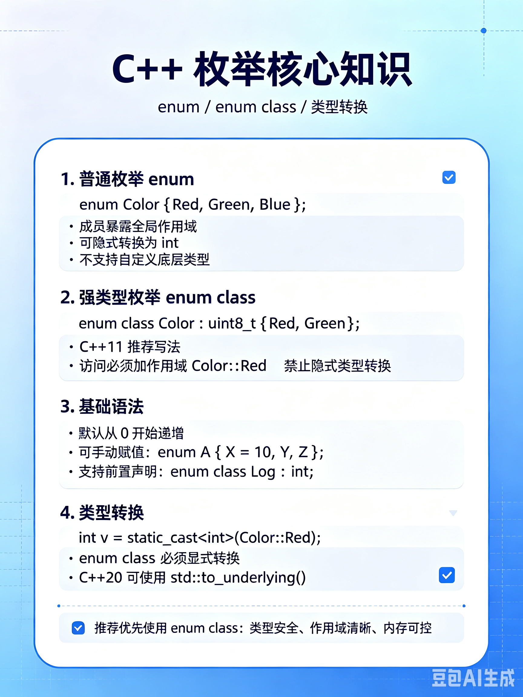
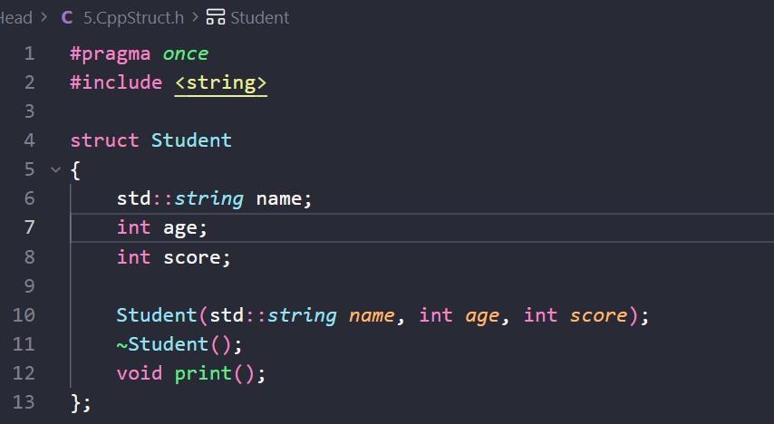
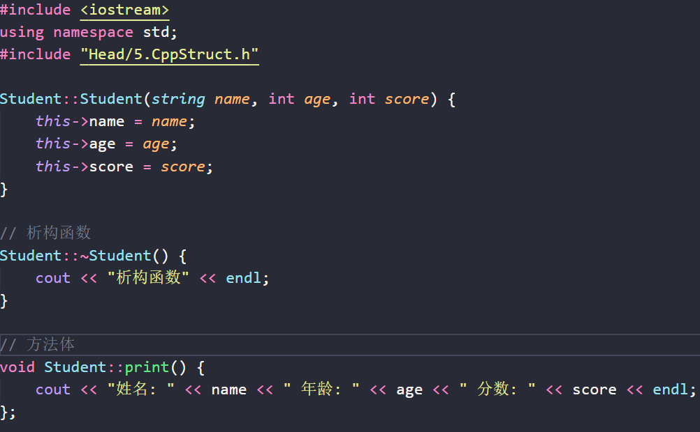
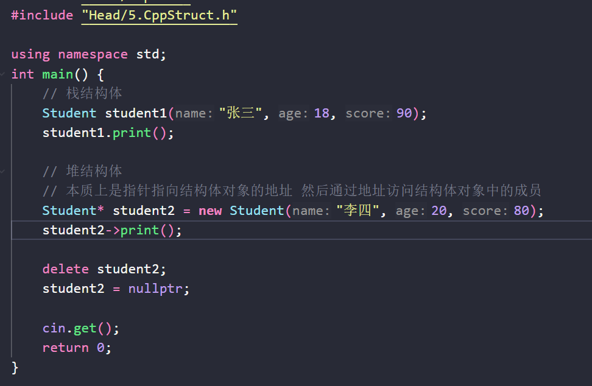
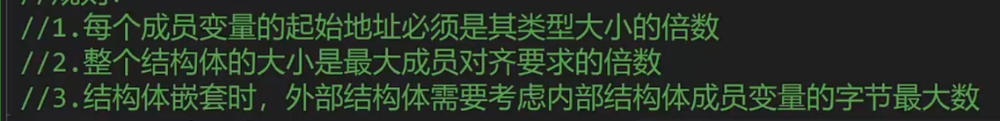
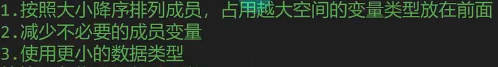

# 1.枚举
看图
****
强类型枚举和C#的枚举使用起来没有什么区别 只是从Enum.A 变成了Enum::A
# 2.数组
## 栈数组
1.栈数组长度必须是**编译期常量** 不能用运行时变量  
比如  int a = 10; int array[a];  标准 C++ 不能通过（这是变长数组扩展）  
可以： int array[10];  或  constexpr int n = 10; int array[n]; 

2.栈数组没有原生长度等方法  
只能  length = sizeof(array)/sizeof(array[0]) （或者 sizeof 其类型）

3.栈数组在函数传递的时候会退化成指针 就不会拿到我们想要的长度信息了

## 堆数组

# 3.结构体
## 结构体声明与使用
这个部分和C#比起来可以说是相当的怪
首先声明是在头文件里面做全量声明

然后在源文件内写具体实现

然后在需要的地方调用
注意栈结构体和堆结构的使用方式有点不同

## 构造与析构

构造函数和C#的构造几乎一致
析构函数一般 释放*内部分配* 的堆内存的指针/引用
## 结构体内存对齐
规则怪谈:

初步解决规则怪谈:

# 4.链表
# 5.树
# 6.哈希Map
