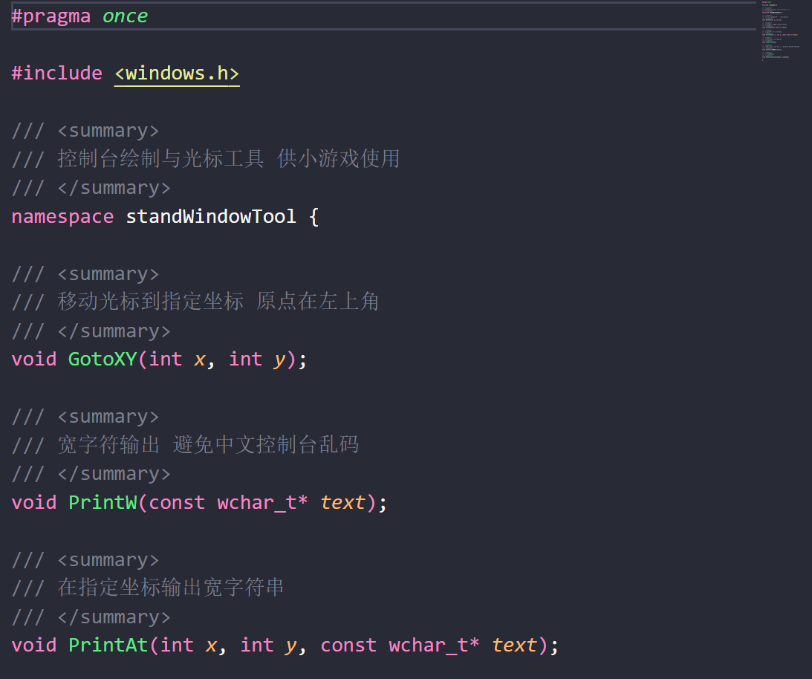
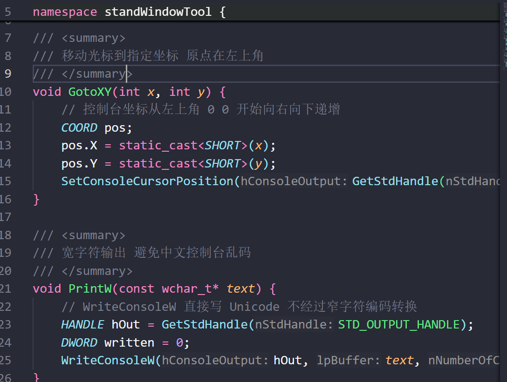
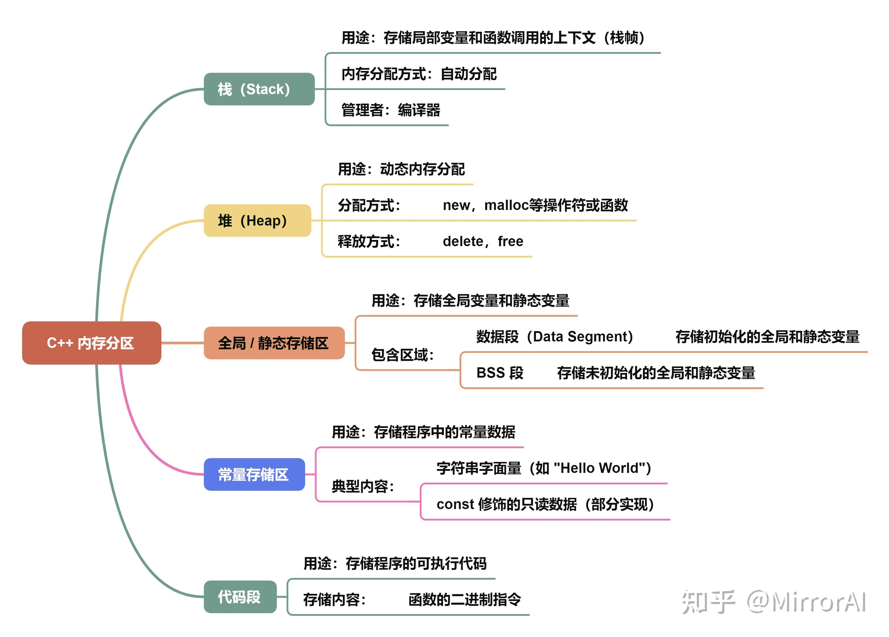
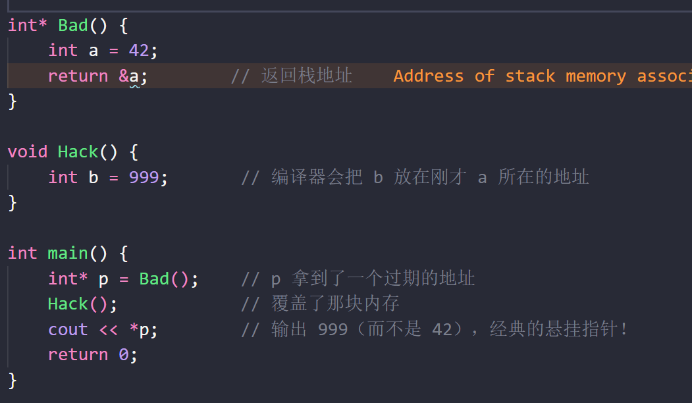
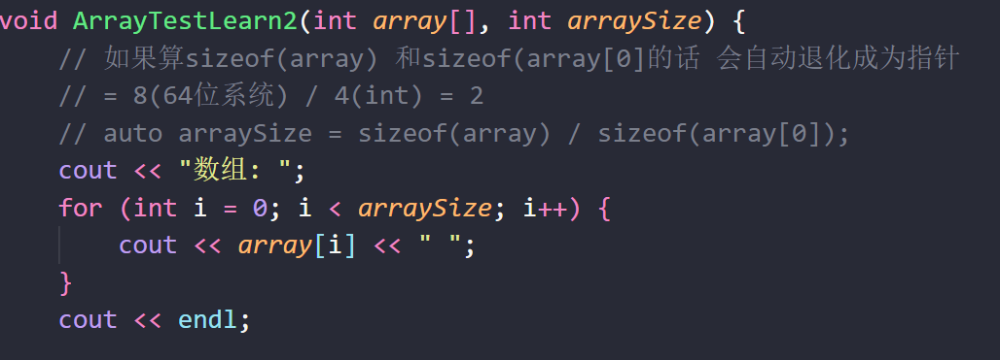
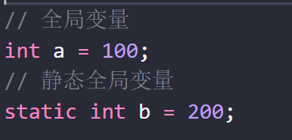
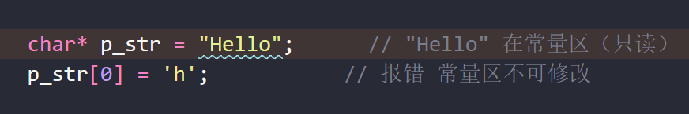

# 0.**编译与链接**

从上图记住四个阶段：**预处理 → 编译 → 汇编 → 链接**  
日常敲 `g++ xxx.cpp` 时中间的 `.i` / `.s` 常常不落盘 但逻辑上这四步都在

## 头文件 = xxx.h
主要放**声明** 告诉别人「有这些函数 / 类型」 一般**不写函数体**

比如下图是一个头文件 它自己 `#include <windows.h>`：  
*预处理阶段*会把被 include 的内容“复制粘贴”到当前位置 得到翻译单元文本（可看成 `.i`）

## 四个阶段分别干什么

**1. 预处理**  
处理 `#include`、`#define`、条件编译等 → 生成 `.i`（纯文本展开结果）

**2. 编译**  
把 `.i` 翻译成**汇编指令**（`.s` / `.asm`）  
若这里只有函数声明、没有函数体 编译器会把该名字记成**未解析的外部符号**：表示“实现在别处 现在先记一笔欠账”

**3. 汇编**  
把 `.s` 翻译成 CPU 认识的**机器码** 生成目标文件 `.obj`（Windows）或 `.o`（Linux）  
目标文件里带有**符号表**等信息 大致是：  
- **我提供了**什么（例如本文件里定义的 `standWindowTool::GotoXY`）  
- **我需要**什么（例如调用了 `SetConsoleCursorPosition` 地址暂时空着 留个坑给链接器）

**4. 链接**  
把各个 `.cpp` 编出来的 `.obj` 再和需要的库（如系统库）拼在一起 生成 `.exe`  
链接器做的是**解析符号 + 重定位（填真实地址）**：  
函数体其实在对应源文件编译/汇编时**已经写进那个 `.obj` 里了**；  
链接不是“再抄一遍函数代码” 而是把调用处的空坑 指到真正有实现的那个地址

## 源文件 = xxx.cpp
放**定义** 真正写函数体  
例如下图：`GotoXY` / `PrintW` 的实现就在 `.cpp` 里；编完后它们的机器码在 `standWindowTool` 对应的 `.obj` 中 供链接阶段给别人用

一句话对照：  
- `#include` 头文件 → 让当前文件**看见声明**（预处理）  
- 工程里编进对应 `.cpp` → 才有**实现**（编译/汇编）  
- 链接 → 把“看见”和“实现”**对上号**

## 命名空间
`using namespace standWindowTool;`  
只表示「这个命名空间里的名字可以省略前缀」  
也就是可以写 `GotoXY(a, b)` 而不必写 `standWindowTool::GotoXY(a, b)`  
它**不是**在“引入库文件”；库/源文件仍要靠头文件声明 + 参与编译链接

# 1.内存分区

BSS = **Block Started by Symbol** 由符号开始的块  
**它在可执行文件（如 .exe）中不占用任何磁盘空间**  
程序加载器（Loader）只需要记录 **BSS 段的起始地址和长度** 等程序运行时 再在内存中把这个区域一次性全部抹零（`memset`）

# 2.栈
栈的增长方式是通过移动栈指针  
它必须是一段连续的内存地址（从高地址向低地址增长）  
Windows 默认栈大小约 1MB 且每一个程序都有自己独立的栈

## 悬挂指针
指针变量里保存的地址 原来指向的那块内存已经被释放（或回收）了 但这个指针本身还在 变成了“悬在空中”的野指针

分析上图:  
执行完 Bad() 会返回出来 a 的栈地址 并且 **a 本身的栈地址被弹出去了 相当于擦了**  
然后执行 Hack() **b 的栈地址会把 a 的地址覆盖掉**  
所以 p 指针就不会拿到语义上想要的内容了
## 栈数组:
栈之中最常见的就是栈数组 下面是一些值得注意的点

1.栈数组长度必须是**编译期常量** 不能用运行时变量  
比如 `int a = 10; int array[a];` 标准 C++ 不能通过（这是变长数组扩展）  
可以：`int array[10];` 或 `constexpr int n = 10; int array[n];`

2.栈数组没有原生长度等方法  
只能 `length = sizeof(array)/sizeof(array[0])`（或者 sizeof 其类型）

3.栈数组在函数传递的时候会退化成指针 就不会拿到我们想要的长度信息了

# 3.堆
堆的管理方式是通过堆管理器  
它在进程的虚拟地址空间中是逻辑上连续（物理上可离散）的内存区域 从低地址向高地址增长  
Windows 默认堆大小不固定 每个进程有自己独立的默认堆 但同一进程内的所有线程共享该堆

# 4.全局/静态存储区

	可读可写

全局变量 -> 默认多文件可用（别的 `.cpp` 可用 `extern` 声明后来用）  
静态全局变量 -> 仅本翻译单元（当前 `.cpp`）看得见  
静态局部变量 -> 名字只在那个局部作用域里用 但变量本身仍是静态存储期（只初始化一次）

# 5.常量存储区

	只读

常见会进这里的东西：
- 字符串字面量 如 `"Hellow, C++!"`
- 一些全局 / 静态的 `const`、`constexpr` 常量（具体看编译器和优化）

注意几点：
- **局部 `const` 变量** 往往仍在**栈上** 并不是一写 `const` 就进常量区
- 这块内存通常映射成**只读** 强行通过指针改写属于未定义行为
- 它和**代码段**常一起被说成“只读区”：代码段偏指令（`.text`） 常量区偏只读数据（`.rodata`） 权限都常是只读 但内容职责不同

全局和常量对照例子：
- `int g = 10;` → 全局 + 静态存储期 → 多半 `.data`（可写）
- `static int s = 20;` → 静态全局 + 静态存储期 → 多半 `.data`（仅本文件可见）
- `const int c = 30;` → 全局 + 静态存储期 + 常质 → 常进 `.rodata`（只读）

# 6.代码段
**代码段**（Code Segment 也叫**文本段 Text Segment**）主要存储**可执行的机器指令**和**只读数据**

程序员写的所有函数（包括普通函数、类的成员函数、模板实例化后的函数）  
经过编译器和汇编器处理后 都会变成 CPU 能识别的 **二进制机器码（Opcode）** 存放在这里

#### 狭义与广义
在很多操作系统的具体实现中（比如 Linux 的 ELF 格式） 狭义上的“代码段”只放指令  
比如:  
当我们说“严格意义上的代码段”时 指的是 ELF 文件（编译出的 `.o` 或可执行文件）内部的一个叫 **`.text`** 的节  
这个 `.text` 节非常纯粹 **只存放 CPU 执行的二进制机器指令**  
里面全是 `mov`、`add`、`call` 之类的操作码 一个字节的数据都不掺和

但**广义的代码段**（即拥有“只读 + 可执行”权限的**内存区域**）通常会包含只读数据  
比如: 当操作系统把程序加载进内存运行时 它**不关心**文件里细分的“节” 它只关心**内存权限**（可读、可写、可执行）

# 7.跨文件
## 引入头文件
这个不必多说 大多数情况下是这么用的
## extern关键字
举例:  
A.cpp 提供全局变量和函数

B.cpp 使用关键字声明以后就可以用了(虽然例子里面没用到 a 变量)

结果: 10 + 1 = 11

# 8.弃用

| 关键字/特性 | 弃用版本 | 移除版本 | 编译器处理方式 |
| --- | --- | --- | --- |
| **`register`** | C++11 | C++17 | 保留关键字但忽略语义；对该变量取地址（`&`）时自动降级为栈区普通变量；C++17 后使用触发编译警告（如 MSVC C5033） |
| **`export`**（模板分离编译） | C++11 | C++17 | 已被标准彻底移除 不再是关键字；使用即报**编译错误** |
| **`throw()`**（动态异常说明） | C++11 | C++17 | 编译器将其替换为 `noexcept` 语义；旧式写法触发**编译警告**（如 MSVC C5040） |
| **`std::auto_ptr`** | C++11 | C++17 | 使用即报**编译错误**；必须替换为 `std::unique_ptr` |
| **C 风格类型转换**（如 `(int)var`） | 从未在标准中弃用 | 未移除 | 编译器不报错 但现代规范**强烈禁止**；推荐使用 `static_cast` / `const_cast` / `reinterpret_cast` |
