由于指针是Cpp比较有特色且重要的一环 所以单独记一篇
 # 1.指针模型
一切都只需要建立一个认知模型即可
指针 = 地址的容器 = 本身也是一个变量(内存位置取决于声明的地方)

对指针类型 使用\*取容器内容
对任意类型变量 使用"&" 取地址

如下图:
a作为int变量占用4字节
a本身的地址(= p指向) 占用8字节 
p本身的地址也占用8字节

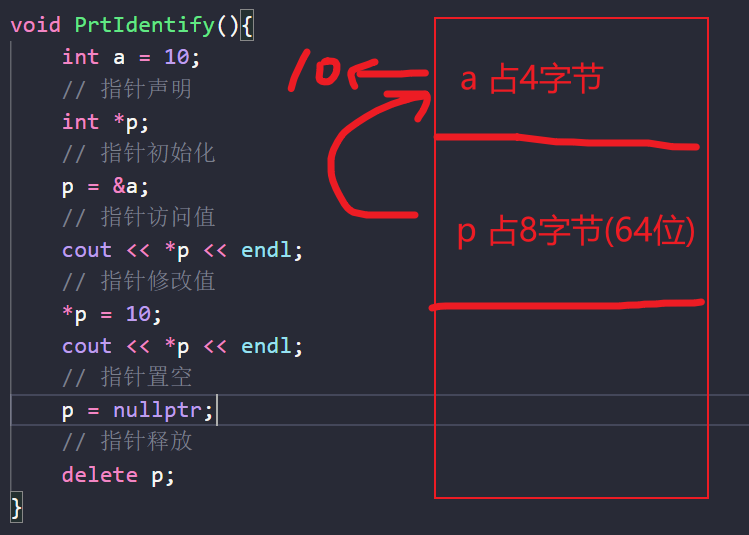

## 指针类型
具体类型指针 Type\*p
万能指针 void \*p
多级指针 Type \*\*p
数组指针 Type (\*p) [n] (注意括号,因为[]的优先级是比\*要高的)
函数指针 Type (\*p)(parms)
智能指针 :
独占所有权 std::unique_ptr
共享所有权 std::shared_ptr 
弱引用        std::weak_ptr
## 指针相关数据结构
指针数组 Type* p[n] 
结构体指针 struct Node 里包含Node* next

## 指针自增减
这里要额外提一句 指针本身的自增减 就是对其声明类型的大小自增减少

# 2.指针与常量
同样建立一个认知模型即可
对"不可变"这个语义 谁在前谁牛逼

指针常量 -> \* const -> 指向地址不可变
常量指针 -> const* -> 指向内容不可变
常量指针常量->const  /*const  都不可变

# 3.指针与数组

## 指针与一维数组
	需要建立一个认知模型:
	array本身 = 首元素地址
	array[n] 相当于在做解引用操作 而且优先级大于 \*
	
在Cpp里 数组变量名本身就是一个地址
直接拿来用和给指针都可以
指针自增减就相当于在数组上面滑动指向
然后解引用就能得到里面的值

## 指针与二维数组
二维数组本身array[0] 相当于第一行的首地址
在此基础上做偏移 然后解引用 或者直接\[x]\[y]是一样的

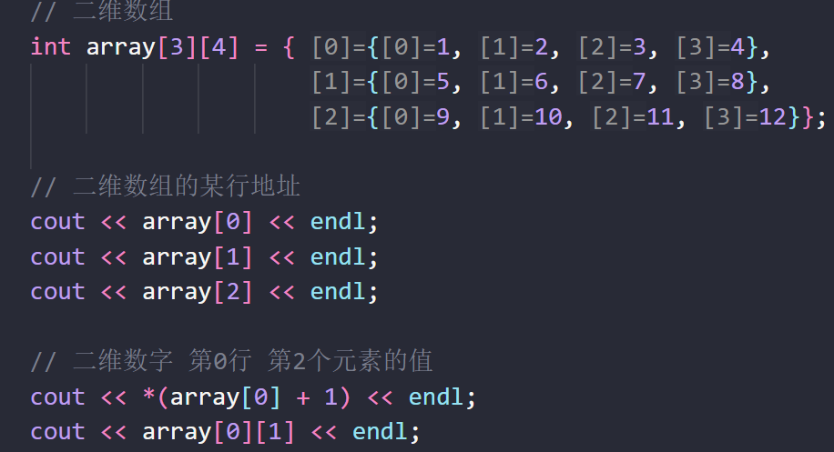

### **数组指针**
有一个很奇葩的概念叫做 **数组指针**
声明方式为 : type (\*变量名)[数组大小]
比如:int (*p)[4]  
p = 整行 数组的起始地址
那么p + 1相当于跳行

\*p 操作相当用从行指针 解引用成为一个具体的元素地址
\*p =p[0] = array[0] 
\*p + 1 就是第一行第2元素的地址(因为第一个元素是0号 也就是*p的地址)

那么在*p的基础上再做解引用 就是具体元素地址指向的值了
不过需要注意的是[n]操作的优先级大于\*
因此\*p[n] = 先找第n行 再做* 解引用

如果想要拿到具体某行某列的值要么括号括起来 先拿到某行的首地址 然后做偏移 

要么直接用数组拿

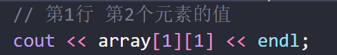

**反正我觉得cpp的设计真的很傻逼**

## 指针与字符数组
没什么好说的 第二个遍历方式是c语言风格的 所以可以不用看

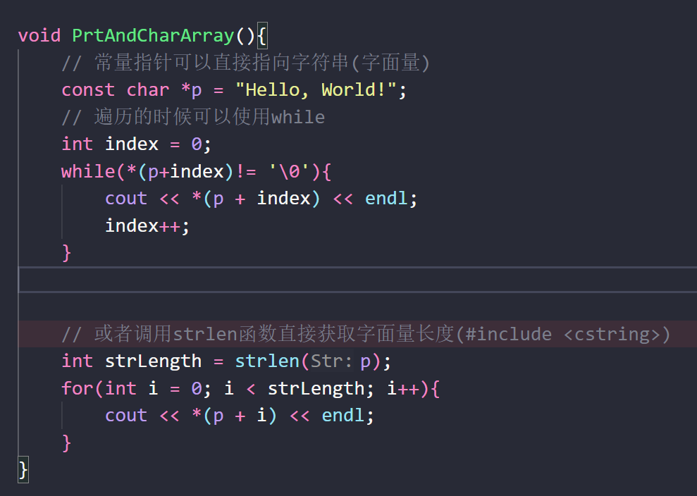

## 指针数组
其实就是一组指针  只不过使用上稍微麻烦了一点点

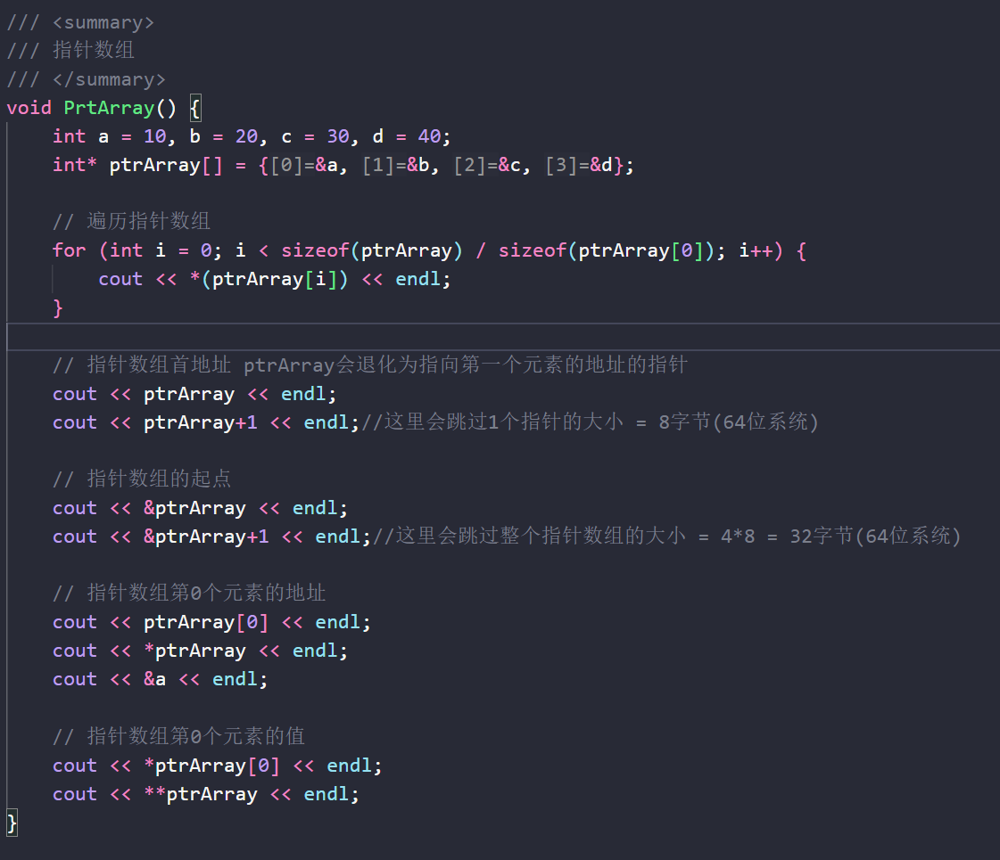

将上面的一堆奇奇怪怪分清楚的话就没问题了
可以结合下图的认知模型再自己看看

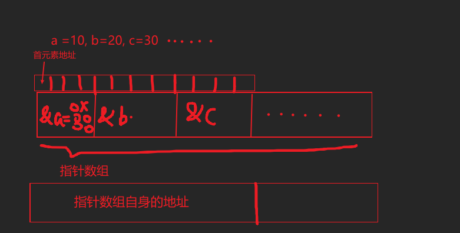

# 4.指针与函数

## 指针当做参数
值得注意的是,如果指针变量当做函数参数传递,那么实际上会产生两个指针变量
只不过被临时创建出来的那个和函数在栈帧上push 然后 pop 所以生命周期很短

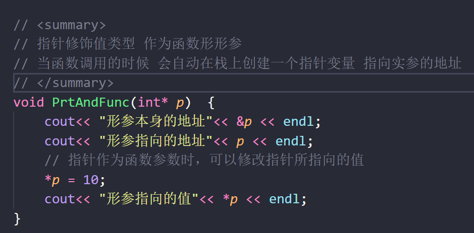

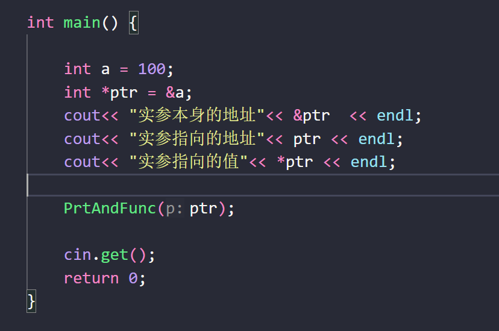

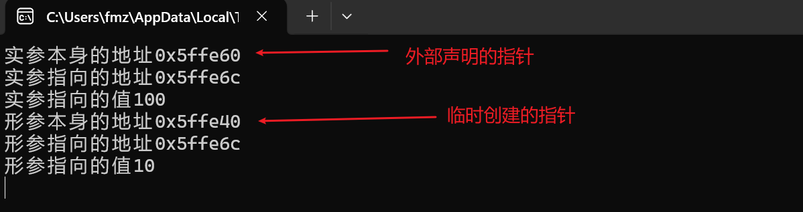

## 指针当做返回值

### 悬挂指针
指针变量里保存的地址 原来指向的那块内存已经被释放（或回收）了 
但这个指针本身还在 变成了“悬在空中”的野指针

分析上图
编译器在执行完 Bad() 会返回出来 a 的栈地址 并且 **a 本身的栈地址被擦了**  
然后执行 Hack() **b 的栈地址会把 a 的地址覆盖掉**  
所以 p 指针就不会拿到语义上想要的内容了

如果非要传递指针当做返回值
可以使用局部静态变量

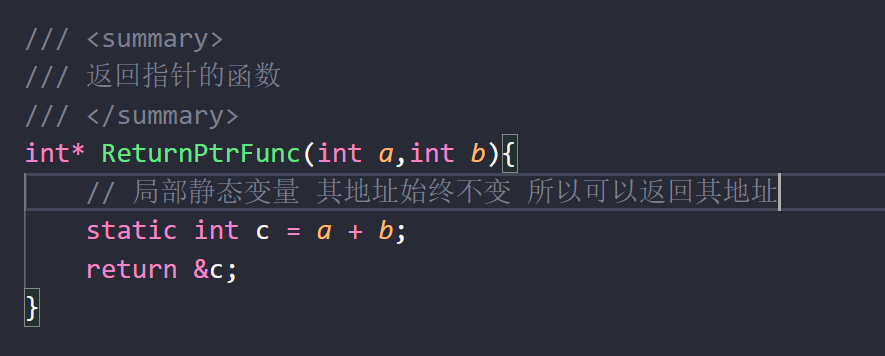

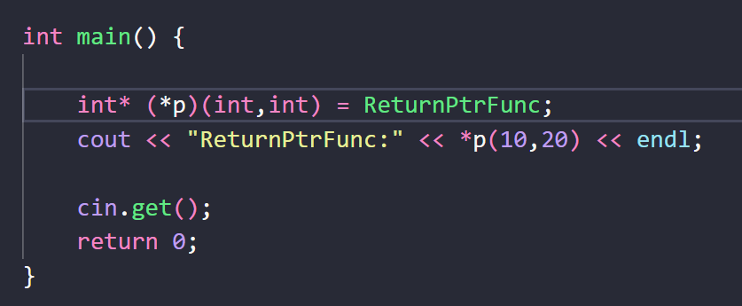
## 函数指针 (委托与回调)
就是委托的原型

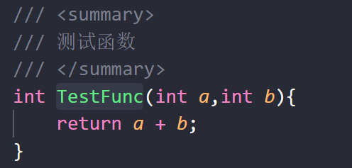

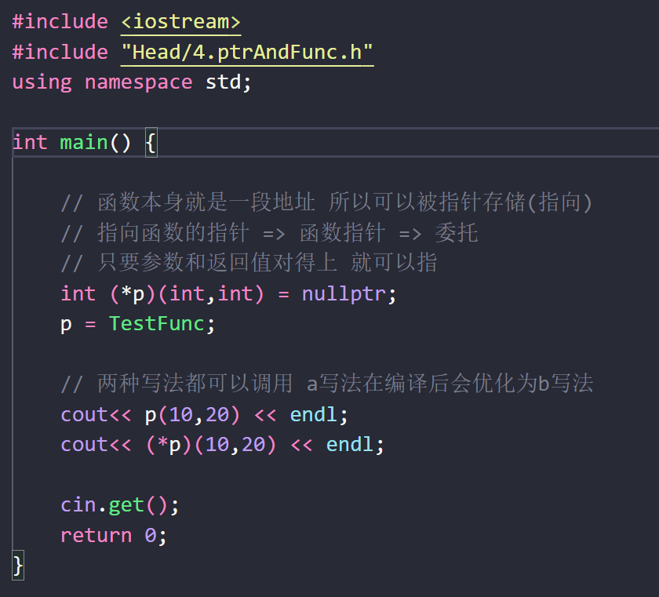

具体使用的话和C#的委托有些许不一样
因为指针是一个变量 所以可以直接在函数形参进行声明

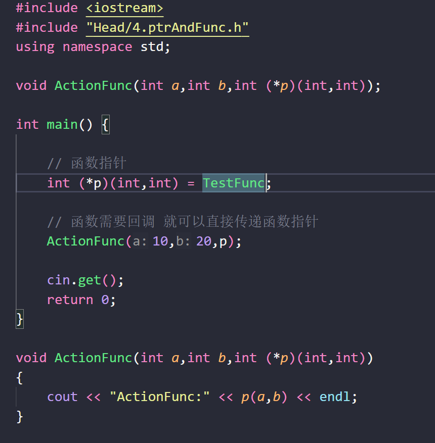

## 指针函数

# 5.指针与指针
多级指针

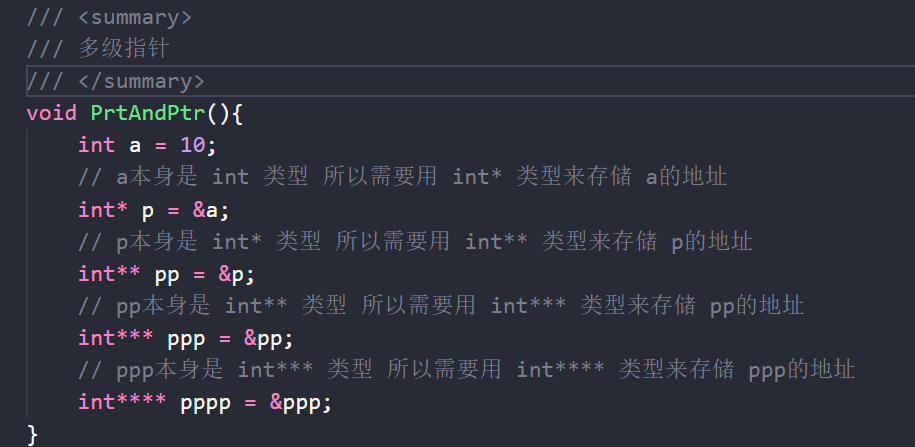

# 6.智能指针

# 7引用
Type& 变量名 = 已经初始化的类型
这个东西不可以修改指向,不过使用的时候会自动解引用

引用可以当做C#里面的ref 和 out使用
常量引用可以当做对局部变量的readonly关键字使用

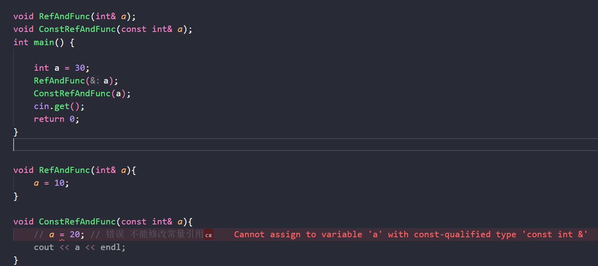

## 左值与右值引用
左值就是平常用的那些可以被赋值的对象,有明确内存地址

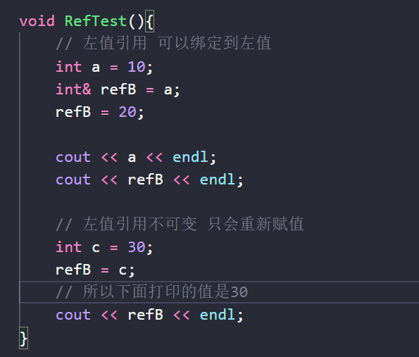

右值就是临时计算结果,无明确内存地址
右值可以被引用,并且右值引用是可变的
Type&& 变量名 = 右值

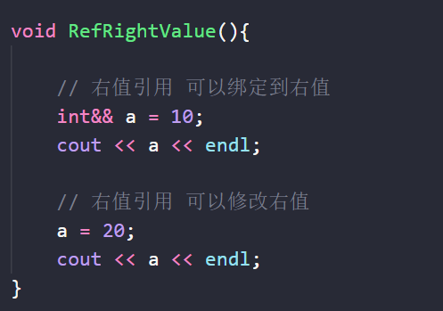

# 8.别名与宏
## 别名
typedef 和 using 的作用差不多 都是为变量类型起别名
但是using 支持模版 且 可读性较好 以后非特殊情况下使用using
## 宏
宏是预处理指令的一种 其在编译后会将宏所定义的内容*替换*使用的位置

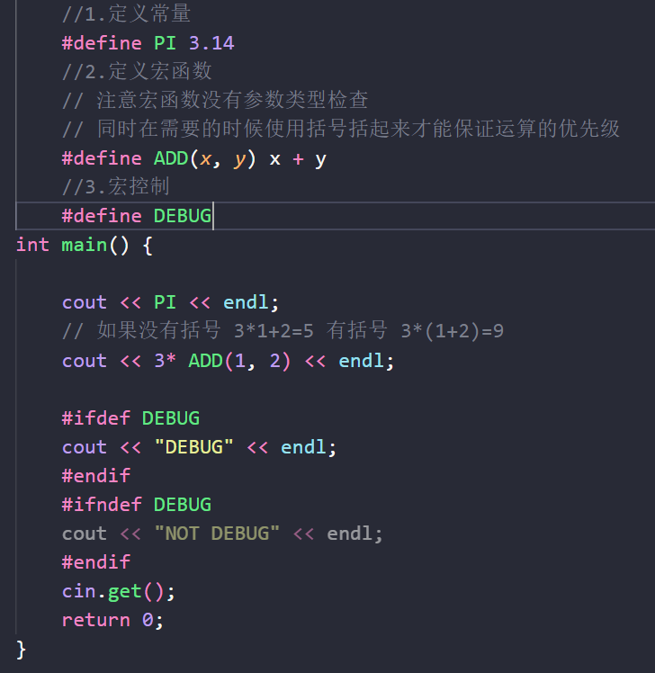
