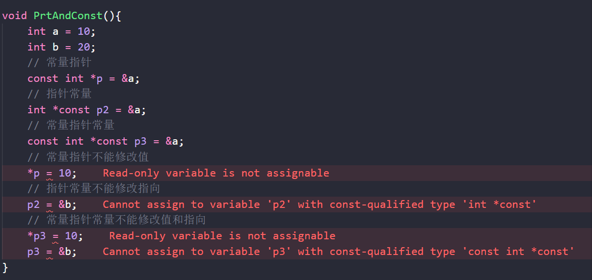
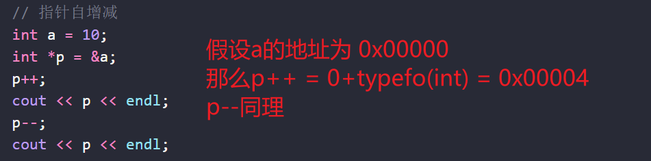
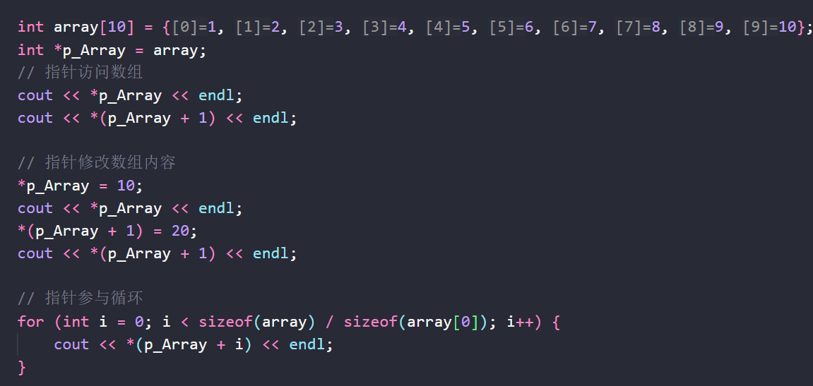
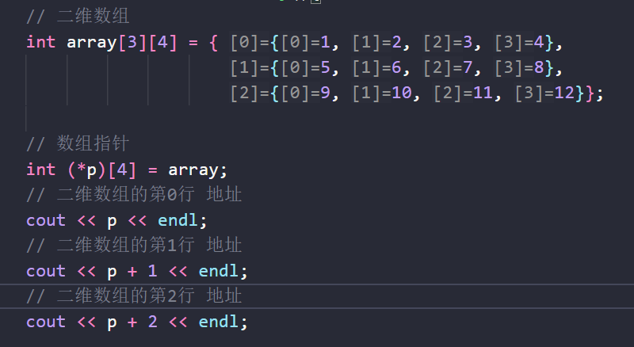
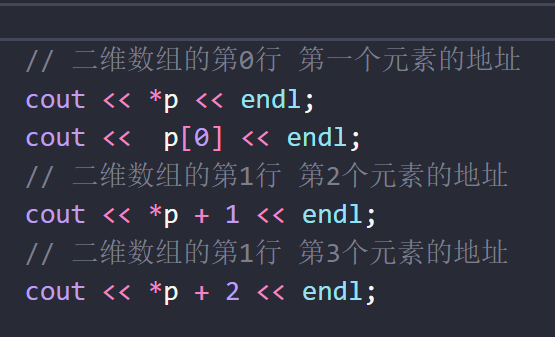
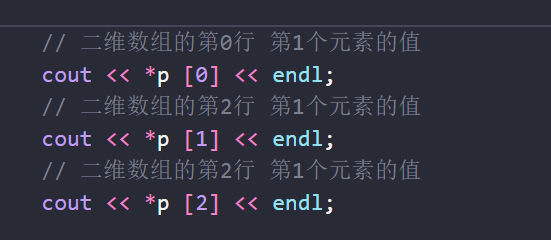
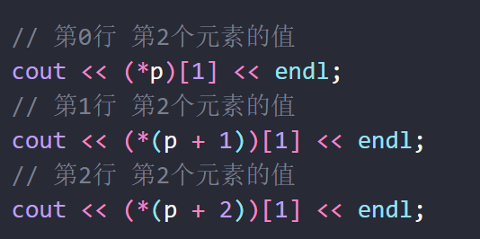

由于指针是Cpp比较有特色且重要的一环 所以单独记一篇笔记
# 1.指针本身
建立一个认知模型即可

指针 -> 地址的容器 ->本身也是一个变量(位置取决于声明的地方)
对指针类型 使用\*取容器内容
对任意类型变量 使用"&" 取地址

# 2.指针与常量
同样建立一个认知模型即可
对"不可变"这个语义 谁在前谁牛逼

指针常量 -> \* const -> 指向地址不可变
常量指针 -> const* -> 指向内容不可变
常量指针常量->const  /*const  都不可变

# 3.指针与数组
### 指针自增减
这里要额外提一句 指针本身的自增减 就是对其声明类型的大小自增减少

### 指针与一维数组
	需要建立一个认知模型:
	array本身 = 首元素地址
	array[n] 相当于在做解引用操作 而且优先级大于 \*
	
在Cpp里 数组变量名本身就是一个地址
直接拿来用和给指针都可以
指针自增减就相当于在数组上面滑动指向
然后解引用就能得到里面的值

### 指针与二维数组
二维数组本身array[0] 相当于第一行的首地址
在此基础上做偏移 然后解引用 或者直接\[x]\[y]是一样的

#### **数组指针**
有一个很奇葩的概念叫做 **数组指针**
声明方式为 : type (*变量名)[数组大小]
比如:int (*p)[4]  
p = 整行 数组的起始地址
那么p + 1相当于跳行

\*p 操作相当用从行指针 解引用成为一个具体的元素地址
\*p =p[0] = array[0] 
\*p + 1 就是第一行第2元素的地址(因为第一个元素是0号 也就是*p的地址)

那么在*p的基础上再做解引用 就是具体元素地址指向的值了
不过需要注意的是[n]操作的优先级大于\*
因此\*p[n] = 先找第n行 再做* 解引用

如果想要拿到具体某行某列的值要么括号括起来 先拿到某行的首地址 然后做偏移 

要么直接用数组拿

**反正我觉得cpp的设计真的很傻逼**

### 指针与字符数组

### 指针数组

# 4.指针与函数
### 指针当做参数
### 指针当做返回值
### 指针指向函数
### 回调函数

# 5.指针与指针
多级指针
