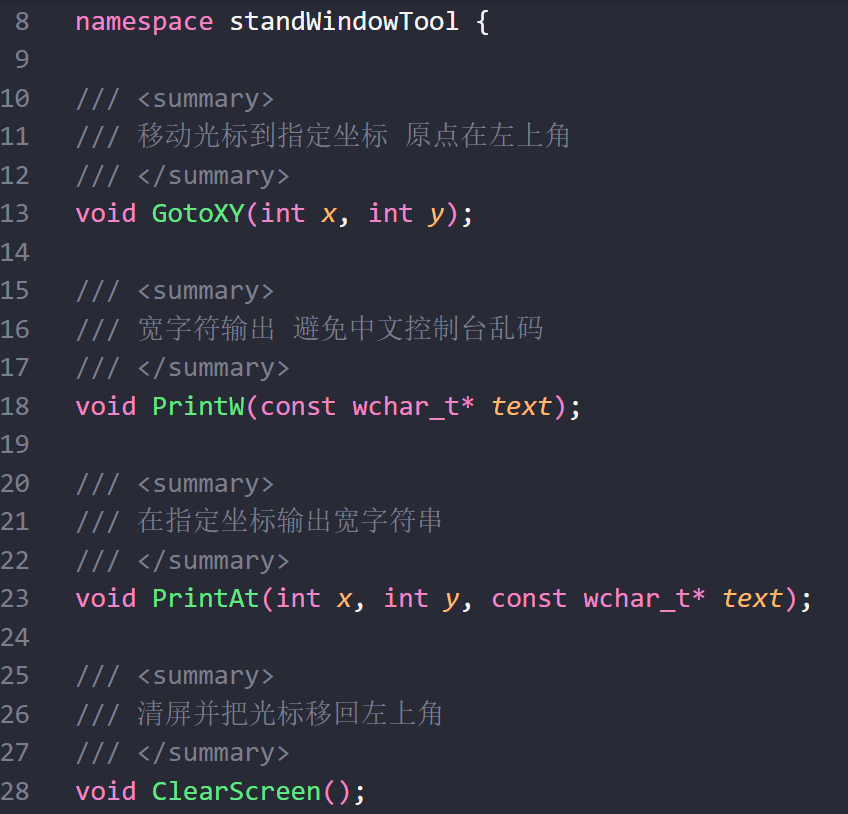
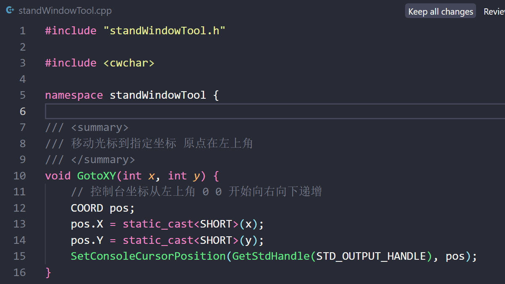
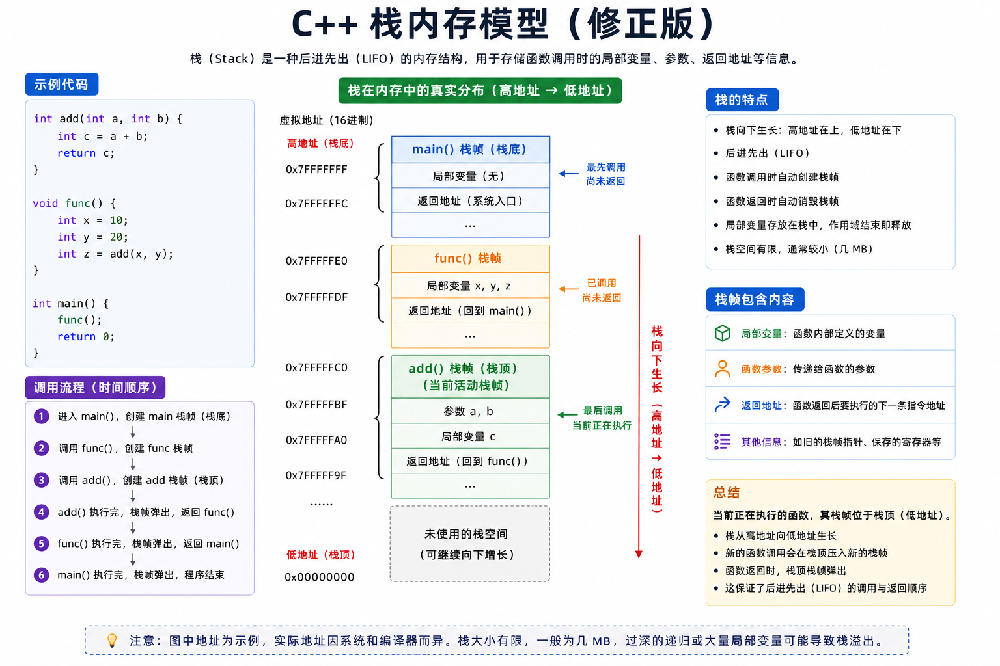
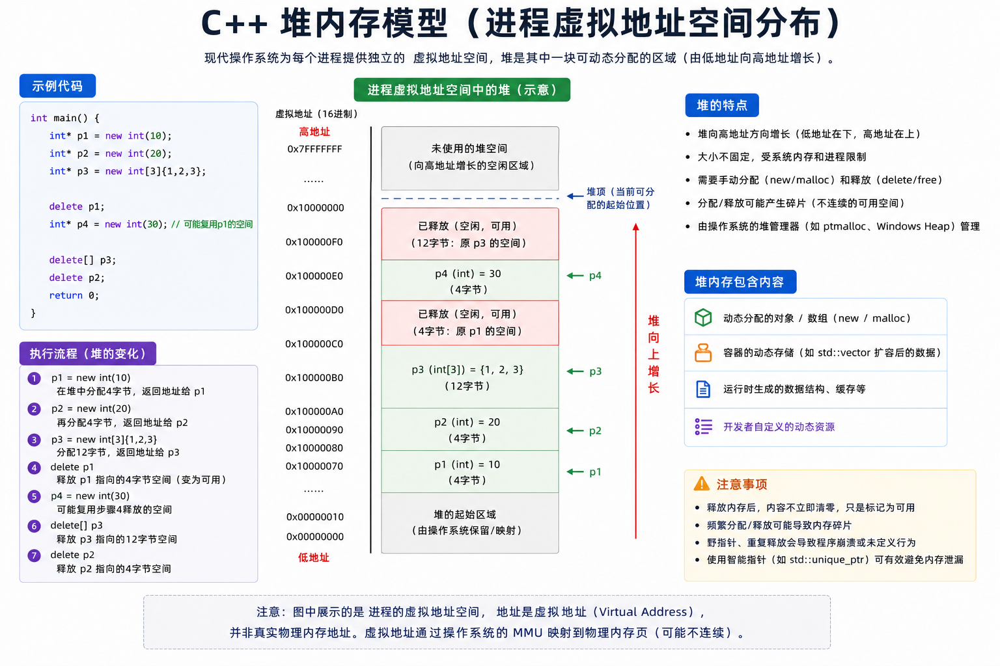
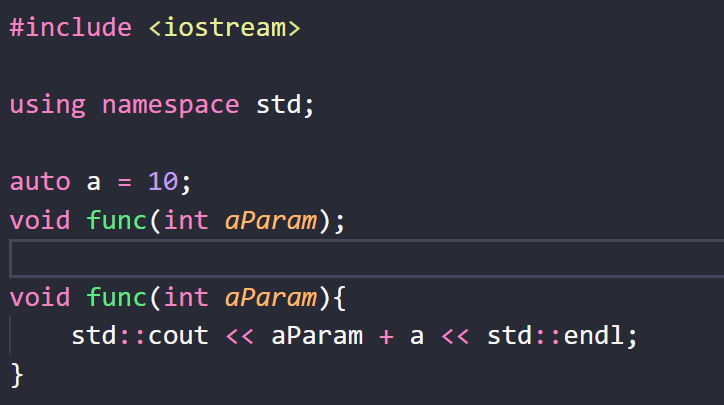
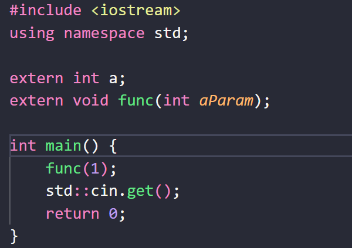

# 0.**编译与链接**

## 头文件 = xxx.h 
声明 告诉别人「有这些函数」
比如下图

#include "xxx.h" 表示我用到了这个文件里面的东西 到时候编译器过来看一下
编译器编 `main.cpp` 时 只看声明(xxx.h) 不自动去读 `standWindowTool.cpp`  
## 库文件 = xxx.cpp 
定义和真正写函数体
比如下图

using namespace standWindowTool;
表示「这个命名空间里的名字可以省略前缀 ] 也就是无需standWindowTool::GtoXY(a,b)了
链接阶段再把各个 `.cpp` 编出来的目标文件拼在一起

# 1.内存分区

BSS = **Block Started by Symbol** 由符号开始的块
**它在可执行文件（如 .exe）中不占用任何磁盘空间**
程序加载器（Loader）只需要记录 **BSS 段的起始地址和长度**，等程序运行时，再在内存中把这个区域一次性全部抹零（`memset`）

# 2.栈
栈的增长方式是通过移动栈指针
它必须是一段连续的内存地址（从高地址向低地址增长）
Windows 默认栈大小约 1MB , 且每一个程序都有自己独立的栈

## **悬挂指针**
指针变量里保存的地址，原来指向的那块内存已经被释放（或回收）了，但这个指针本身还在，变成了“悬在空中”的野指针

分析上图:
执行完 Bad() 会返回出来a的栈地址 并且 **a本身的栈地址被弹出去了 相当于擦了**
然后执行 Hack() **b的栈地址会把a的地址覆盖掉**
所以 p指针就不会拿到语义上想要的内容了
## 栈数组:
栈之中最常见的就是栈数组,下面是一些值得注意的点

1.栈数组不能使用常量赋值长度 
比如 int a = 10 ; int array[a];

2.栈数组没有原生长度等方法
只能length = sizeof(array)/sizeof(array[0]) (或者sizeof其类型)

3.栈数组在函数传递的时候会退化指针 就不会拿到我们想要的长度信息了

# 3.堆
堆的管理方式是通过堆管理器
它在进程的虚拟地址空间中是逻辑上连续（物理上可离散）的内存区域，从低地址向高地址增长
Windows 默认堆大小不固定，每个进程有自己独立的默认堆，但同一进程内的所有线程共享该堆

# 4.全局/静态存储区

全局变量 -> 多文件使用 
静态全局变量 -> 单文件使用 
静态局部变量 -> 所在局部作用域使用

# 5.常量存储区

# 6.代码段

# 7.跨文件
## 引入头文件
这个不必多说,大多数情况下是这么用的
## extern关键字
举例:
A.cpp提供全局变量和函数

B.cpp 使用关键字声明以后就可以用了(虽然例子里面没用到a变量)

结果: 10 + 1 = 11

# 8.弃用

| 关键字/特性                     | 弃用版本     | 移除版本  | 编译器处理方式                                                                     |
| -------------------------- | -------- | ----- | --------------------------------------------------------------------------- |
| **`register`**             | C++11    | C++17 | 保留关键字但忽略语义；对该变量取地址（`&`）时自动降级为栈区普通变量；C++17 后使用触发编译警告（如 MSVC C5033）           |
| **`export`**（模板分离编译）       | C++11    | C++17 | 已被标准彻底移除，不再是关键字；使用即报**编译错误**                                                |
| **`throw()`**（动态异常说明）      | C++11    | C++17 | 编译器将其替换为 `noexcept` 语义；旧式写法触发**编译警告**（如 MSVC C5040）                         |
| **`std::auto_ptr`**        | C++11    | C++17 | 使用即报**编译错误**；必须替换为 `std::unique_ptr`                                        |
| **C 风格类型转换**（如 `(int)var`） | 从未在标准中弃用 | 未移除   | 编译器不报错，但现代规范**强烈禁止**；推荐使用 `static_cast` / `const_cast` / `reinterpret_cast` |
