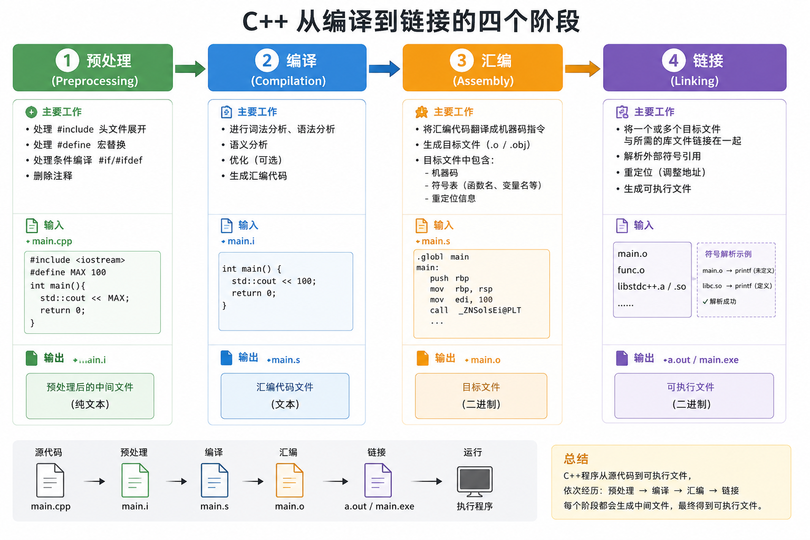

# 0.**编译与链接**

## 头文件 = xxx.h 
声明 告诉别人「有这些函数」
比如下图

#include "xxx.h" 表示我用到了这个文件里面的东西 到时候编译器过来看一下
编译器编 `main.cpp` 时 只看声明(xxx.h) 不自动去读 `standWindowTool.cpp`  
## 库文件 = xxx.cpp 
定义和真正写函数体
比如下图

using namespace standWindowTool;
表示「这个命名空间里的名字可以省略前缀 ] 也就是无需standWindowTool::GtoXY(a,b)了

链接阶段再把各个 `.cpp` 编出来的目标文件拼在一起

# 1.内存分区

BBS = **Block Started by Symbol** 由符号开始的块
**它在可执行文件（如 .exe）中不占用任何磁盘空间**
程序加载器（Loader）只需要记录 **BSS 段的起始地址和长度**，等程序运行时，再在内存中把这个区域一次性全部抹零（`memset`）

# 2.栈

# 3.堆

# 4.全局/静态存储区

全局变量 -> 多文件使用 
静态全局变量 -> 单文件使用 
静态局部变量 -> 所在局部作用域使用

`#include <iostream>`
`using namespace std;`
`// 全局变量`
`auto a = 10;`
`// 静态全局变量`
`static auto b = 20;`
`int main() {`
    `// 静态局部变量`
    `static auto c = 30;`
    `std::cin.get(); // 等待按回车`
    `return 0;`
`}`
# 5.常量存储区

# 6.代码段

# 7.跨文件
就是用extern关键字
举例:
A.cpp

B.cpp

结果: 10 + 1 = 11
# 8.弃用

| 关键字/特性                     | 弃用版本     | 移除版本  | 编译器处理方式                                                                     |
| -------------------------- | -------- | ----- | --------------------------------------------------------------------------- |
| **`register`**             | C++11    | C++17 | 保留关键字但忽略语义；对该变量取地址（`&`）时自动降级为栈区普通变量；C++17 后使用触发编译警告（如 MSVC C5033）           |
| **`export`**（模板分离编译）       | C++11    | C++17 | 已被标准彻底移除，不再是关键字；使用即报**编译错误**                                                |
| **`throw()`**（动态异常说明）      | C++11    | C++17 | 编译器将其替换为 `noexcept` 语义；旧式写法触发**编译警告**（如 MSVC C5040）                         |
| **`std::auto_ptr`**        | C++11    | C++17 | 使用即报**编译错误**；必须替换为 `std::unique_ptr`                                        |
| **C 风格类型转换**（如 `(int)var`） | 从未在标准中弃用 | 未移除   | 编译器不报错，但现代规范**强烈禁止**；推荐使用 `static_cast` / `const_cast` / `reinterpret_cast` |
