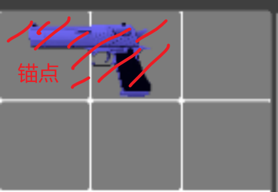
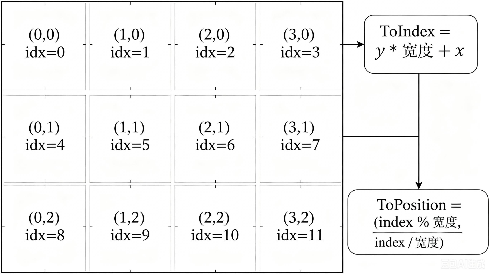
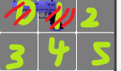
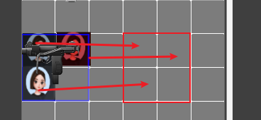
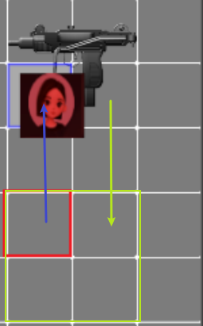

## 1. 设计方案

锚点占用 + 网格占用 两层一维数组维护整个背包的信息

- 锚点数组负责查这个位置 **是什么**
- 网格数组负责查这个位置 **有没有**

## 2. 锚点

锚点就是物品左上角的格子，用于交换的时候判断具体沿哪个点延伸

比如上面图中的手枪，锚点就是 0,0 点的位置，尺寸为 2x1  
那以 0,0 点向右移动 x = 2 个单位，向下移 y = 1 个单位，就可以描述出来这个物品的占用信息了  
（Y 向下是我举例说明随口说的，应该以笛卡尔坐标系，Y 向上为正为准）

为了压缩信息，可以将二维转为一维原理如下：

这样的话，就可以清晰知道哪个格子有什么，而且可以将不太好维护的二维数组转为一维数组管理

## 3. 放置

有了锚点的概念，那放置其实就非常简单了  
如果网格上没有物品，那么就直接以锚点为延伸放置即可

比如我可以这样描述：  
在一维锚点数组之中 0 号有锚点，1 号没有  
在一维网格占用数组之中 0 号和 1 号都有物品

## 4. 删除

同样非常简单，直接将两个数组之中关于此物品的 index 擦除即可

## 5. 堆叠与拆分

这个问题在于数据的 Data 是否设置了可堆  
如果可堆的话是一个很简单的流程：

新物品数量 + 覆盖物品数量 > 最大堆叠数量？

- 多出来的拆分出去：擦除拖拽的物品，创建新的拆分项并找空位放置
- 否则：擦除拖拽的物品，直接加上去

如果不可堆则走交换逻辑

## 6. 交换

这个稍微有点复杂，网格物品存大小不一的情况，因为要分出两种情况不同讨论

> 不过三个情况都有一个前提：交换前后物品不能发生丢失！  
> 所以需要提前试算和回滚

**试算：**

- 记录下 a、b 的旧锚点
- 清掉 a、b 的占用
- a 放到 b 的旧锚点
- b 放到 a 的旧锚点

**回滚：**

如果发现校验不通过，a 和 b 都放回到原来的位置

### 等面积交换

直接交换锚点和占用信息即可

### 大换小

最复杂的情况

拿掉大件、小件  
1.大件尝试先放置到松手的位置  
2.然后每个小件先在大件原来的矩形里保持相对位置不变，尝试找位置
3.找位置的过程中发现放不下则尝试旋转
4.最后再在全背包里面找个能放的下空位  

有一个小件放不下则整次交换失败

### 小换大

1.拿掉小件、大件  
2.小件放到松手的位置  
3.大件尝试放到小件原来的锚点，不行再在全背包里面找个能放的下空位  

（通常来说是大件）放不下则交换失败

