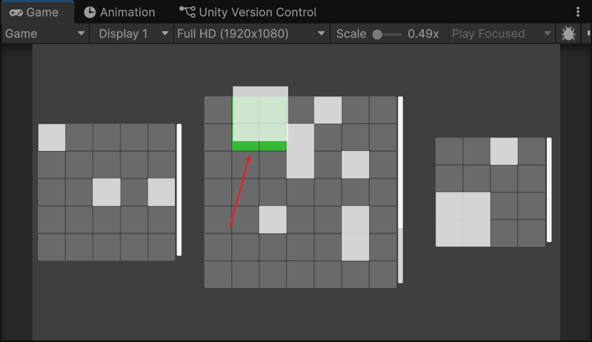
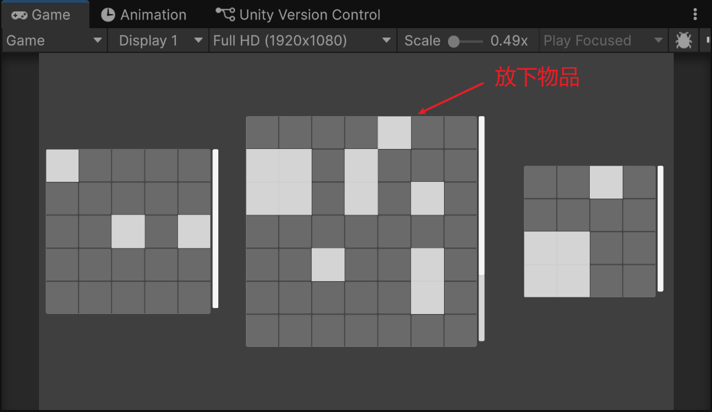
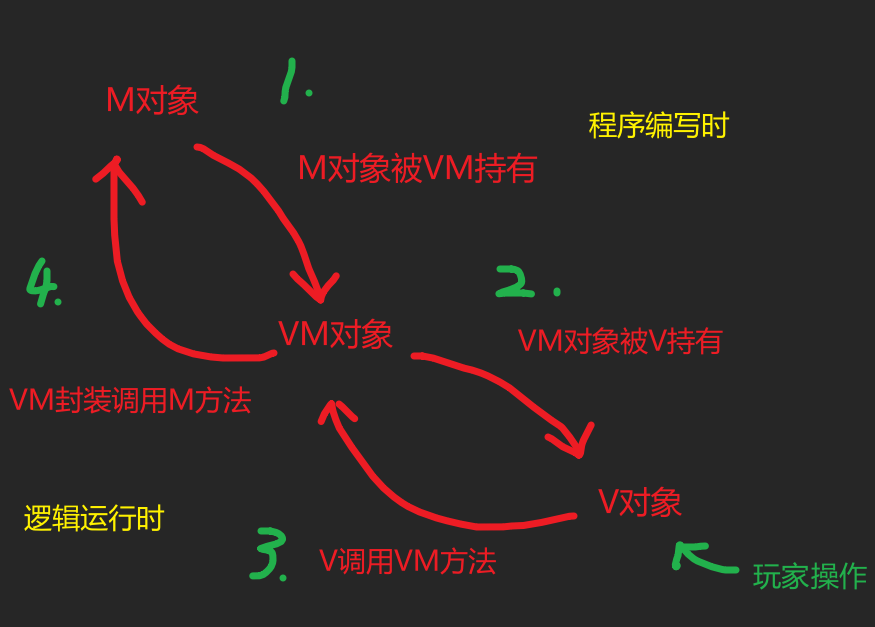
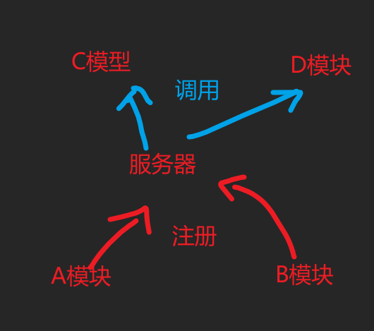

# 1.作用
首先一切为了解耦和复用
一般来说M(Model)的数据是一些算法和逻辑,是可以稍微改改就在不同项目进行复用的
但是V(View)的话 不同项目的表现肯定不完全一致 所以M和V不能达到不可拆的地步
那么VM(ViewModel)作为粘合剂来说就极为重要了,他的一半代码是重新写的,一半代码是拿来复用的

M:纯数据 
比如库存系统计算网格内占用的位置,图中为DebuggerWindow 可以直接测数据

V层:纯表现
如图中的高亮显示格子 这种逻辑就必须放在V层

VM层:
中间层,拿到V层信息 并 调用M方法  

# 2.调用原理

内部调用 一张图就能看懂

跨模块调用我使用了服务器定位模式

# 3.代码结构
参考Github
git@github.com:Haki-sheep/MmCSharp-MMVM.git
