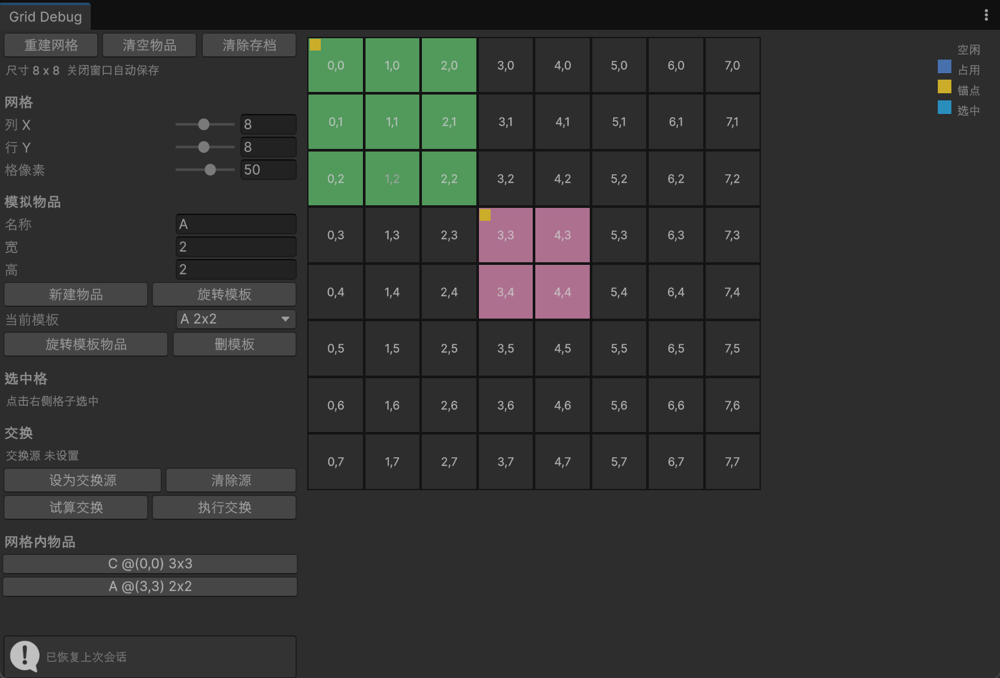

## 1. 作用

首先一切为了解耦和复用。

一般来说 M（Model）的数据是一些算法和逻辑，是可以稍微改改就在不同项目进行复用的。但是 V（View）的话，不同项目的表现肯定不完全一致，所以 M 和 V 不能达到不可拆的地步。那么 VM（ViewModel）作为粘合剂来说就极为重要了，他的一半代码是重新写的，一半代码是拿来复用的。

**M：纯数据**

比如库存系统计算网格内占用的位置，图中为 DebuggerWindow，可以直接测数据。

**V 层：纯表现**

如图中的高亮显示格子，这种逻辑就必须放在 V 层。

**VM 层**

中间层，拿到 V 层信息并调用 M 方法。

## 2. 调用原理

内部调用，一张图就能看懂。

跨模块调用我使用了服务器定位模式。

## 3. 代码结构

参考 GitHub：[Haki-sheep/MmCSharp-MMVM](https://github.com/Haki-sheep/MmCSharp-MMVM)
