首先评估一下问题规模
  一个运动学控制器在U3d的最小原型 约 400～800 行 ,覆盖了走/坡/跳/墙滑这些基础问题
  
  实际上在使用U3d提供的CharacterController下80 ~200行就能做一个角色控制器原型
UE就更不用说了,直接往场景里一拖ACharacter就完事了

 但是一个好的运动学控制器面对的是:*楼梯、悬崖、折角走廊、移动平台*
 在支持的地形集合里，行为*可预期、少抖动、少穿模*

  那么一些天然提供的组件就很难支持到了,那么基于需求
  如果想要角色更像角色 -> 基于运动学+数学知识,完全在*代码层面*模拟角色
  如果想要角色更像物理体 -> 基于运动学+刚体组件 通过*物理引擎*模拟角色

	因此,我仿照经典运动学控制器KCC制作了一个MotionCharacterController,并总结了以下12条需要考虑的问题 以及具体解法,难度依次递增 希望可以加强这个问题的认知 

# 1.单机内核
## 1.1 形状与查询 ★1
这部分很简单
需要一个胶囊体的碰撞体 并且缓存其各个部分的位置 以及*实时计算*三轴方向

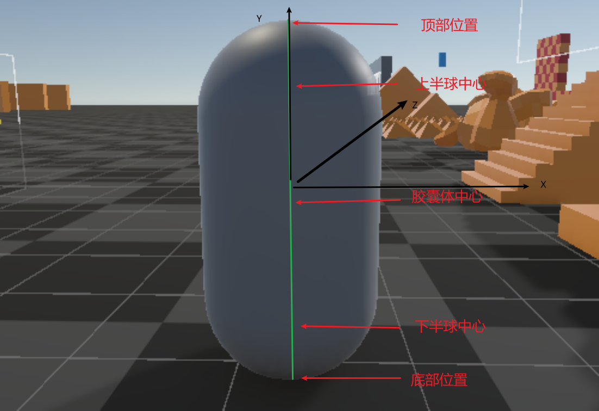

Q:记录胶囊体信息做什么?

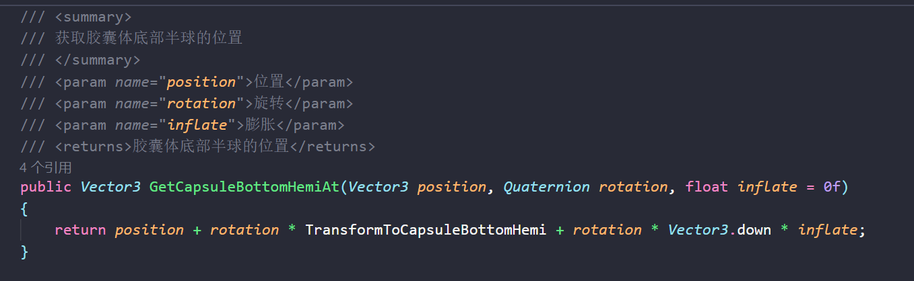

A:做碰撞的,这些信息通常是在初始化阶段 读取CapsuleCollider组件得到的
在后续问题之中,通常采用了Unity封装好的物理方法做胶囊体扫略投射 所以就需要可靠的胶囊体信息,不然射线检测输入都错了 那输出肯定也错

Q:为什么要实时计算角色三轴的位置?不直接采用Transform提供的坐标向量?

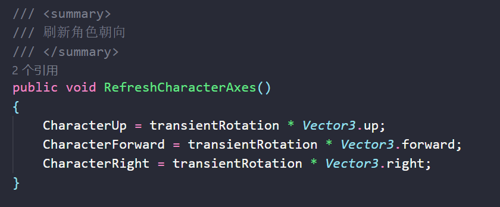

A:虽然Transform提供的信息本身是准确的
但是MCC中采用了一帧内使用Transient模拟位置和旋转 
最后在模拟完成之后提交给Transform

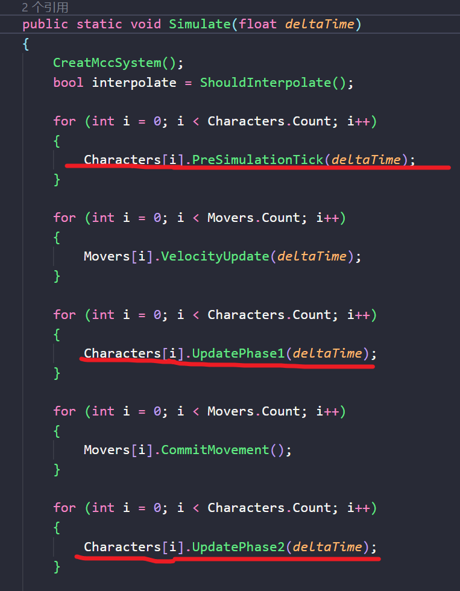

好处:
1.解重叠、接地、跟平台、Move 多步改位姿,若每步写 Transform，查询和别的脚本很容易读取到没算完的值
2.计算量也会很大,通常来说我们不希望频繁去修改Transform的属性
3.FixUpdate算完了 让LaterUpdate插值 可以让表现更加平滑
4.多角色/平台可以使用同一套 Simulate；先全员算 Transient，再统一Commit
5.可以暴露方法去读写 Transient这个中间量 那么联网回滚就不再是困难了
## 1.2 瞬时位姿 ★1
Q:什么叫做瞬时位姿?为什么要这个东西?
A:答案和1.1的最后一个问题是一致的

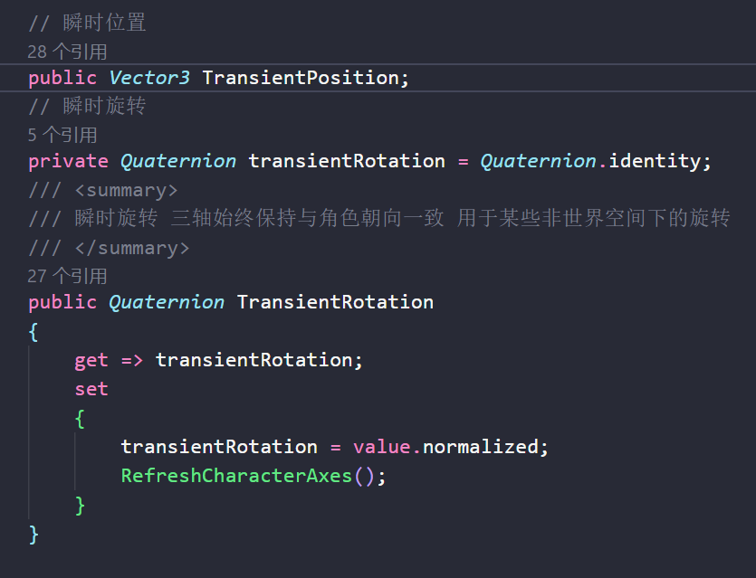

*值得注意的是!*
选择LaterUpdate插值和选择直接不插值是两套的运行逻辑!

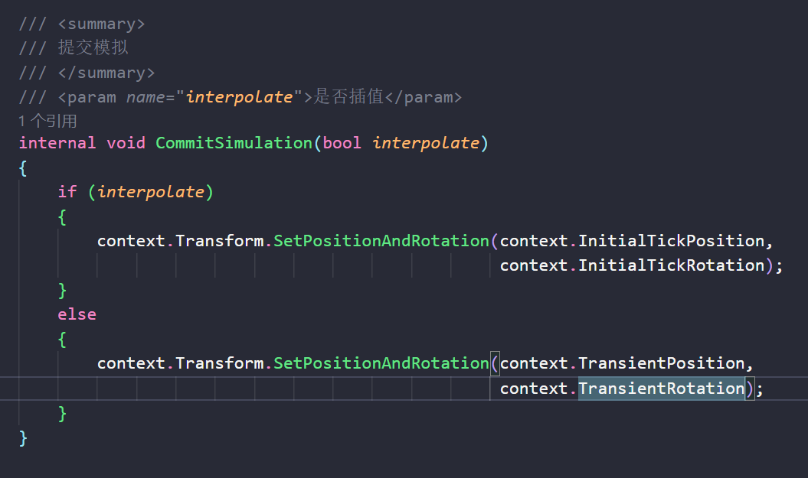

如果插值,那么会将本物理步内的位置和旋转重新给到Tranform 然后让LaterUpdate去Lerp和Slerp

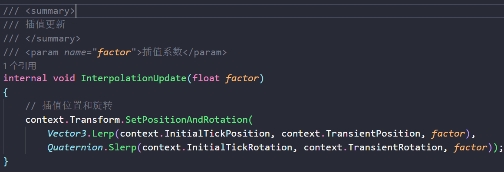

## 1.3 数值安全 ★0.5
这个部分没什么好说的 就是如果出现计算错误 比如分式分母=0 直接将无效速度清零即可

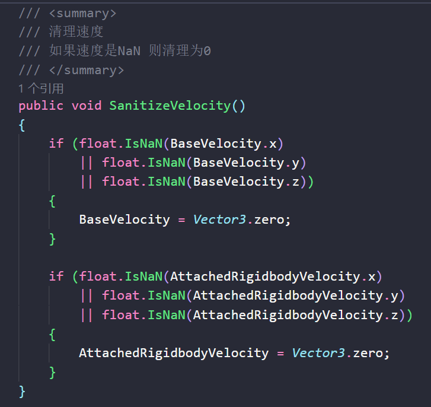

还有一些碰撞迭代保护计算上限,约束平面出现奇怪法线,可以在后续问题之中体现出来
## 1.4 速度 ★2
这个部分主要是走/跳/重力是手感
记住一个原则:
任何运动意图都可以使用一个*基础向量 BaseVelocity* 表现

平面移动 => BaseVelocity的XZ改变
斜坡移动 =>BaseVelocity的YZ改变 (通常认为Z是向前)
跳跃 => BaseVelocity的Y改变

所以*MCC内部处理这个基础向量* 

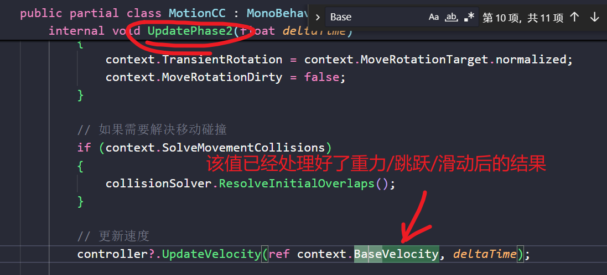

然后将该向量通过接口主动暴露给外部开发者(Vector3为值类型所以使用ref 传递出来)

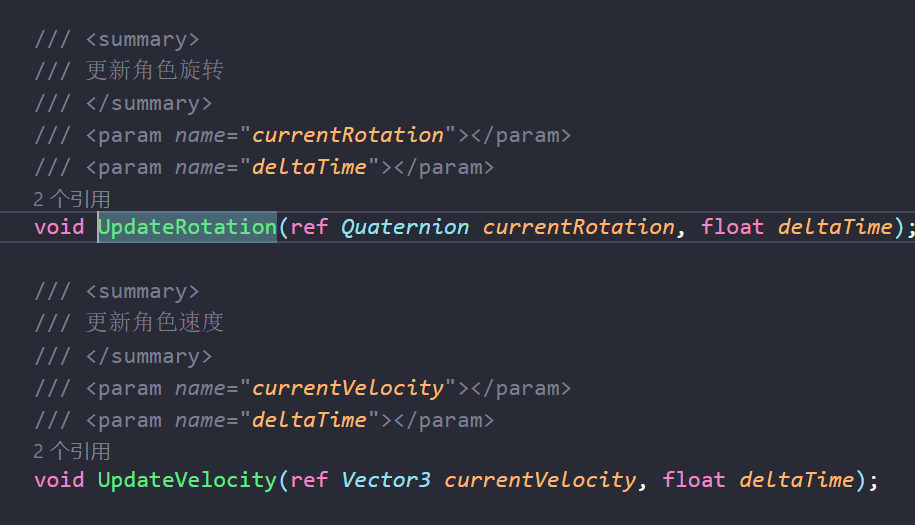

那么无论是方向 x 标量 = 速度
还是 速度 x 时间 = 位移
随便折腾 都没问题 嘻嘻

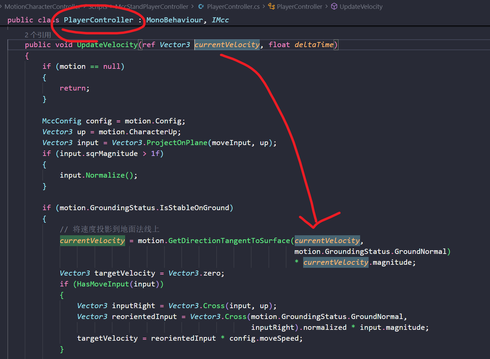

Q:那这个向量在MCC内部的何处修改?
A:主要是在碰撞求解部分 做撞墙投影/内角折线
可以在源码这个部分查看

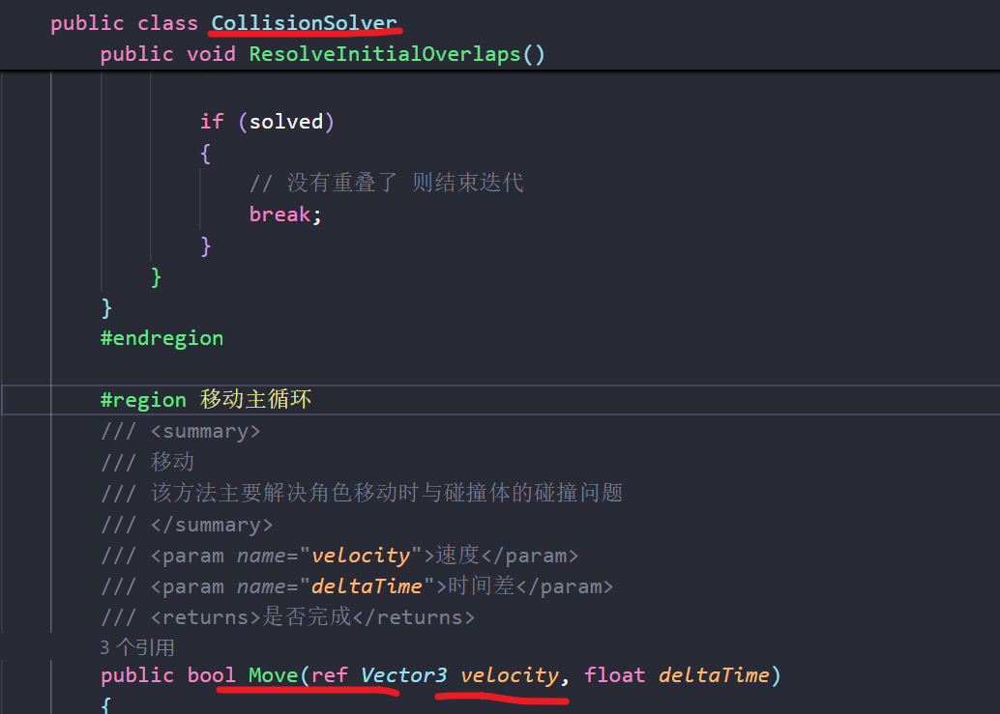

## 1.5 回调过滤 ★2
MCC的内核在做地面稳定判断 / 和谁碰撞  由外部开发者一票决定
判断碰撞接口

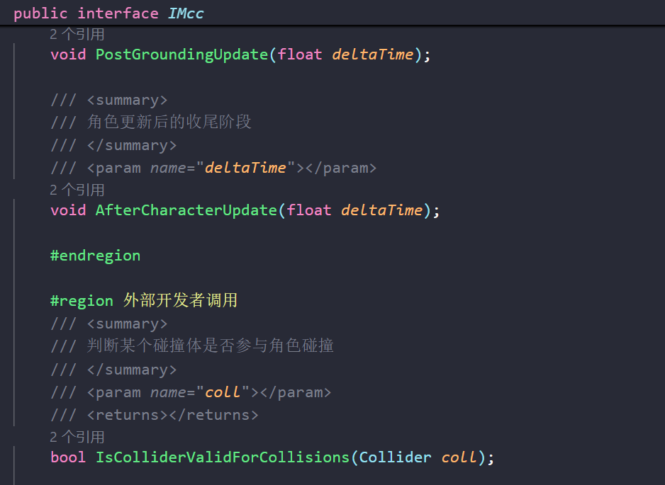

如何实现?如下图所示,这个方法在多处有调用,所以不做一一解释
主要看碰撞解算(撞墙,做解重叠),地面碰撞解算处调用

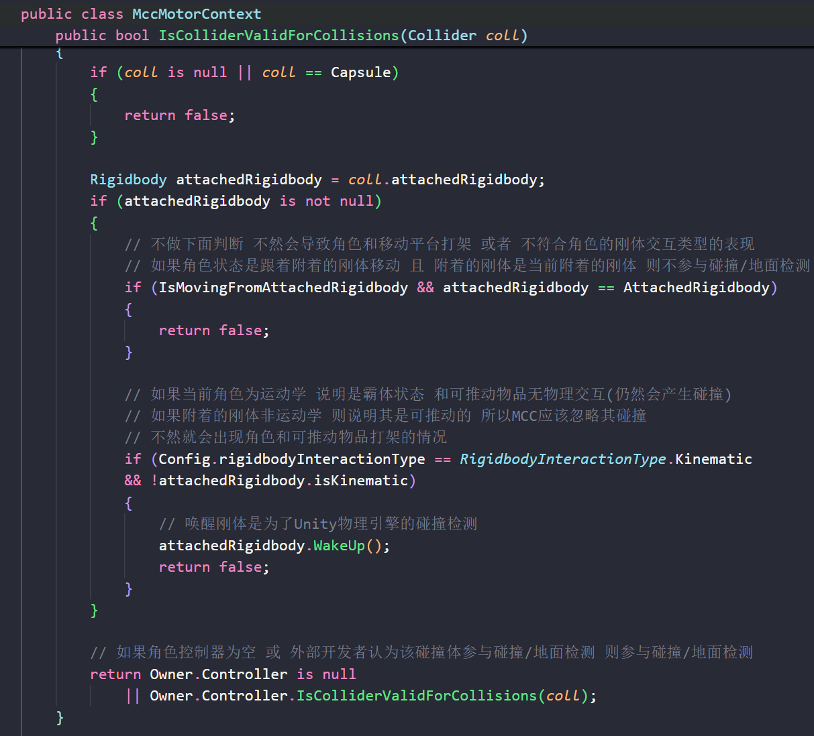

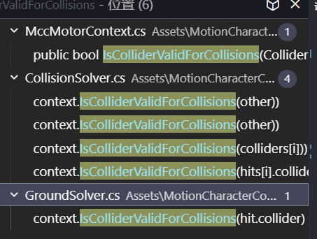

地面稳定性判断接口

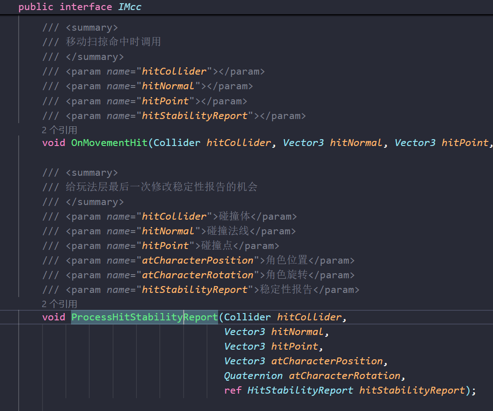

在哪调用?用于评估地面稳定性
也就是说你可以直接修改ref进去的报告 根据其他传递参数修改稳定性报告的细节
比如:我就是不认为角色当前站在地面上 而是在水中

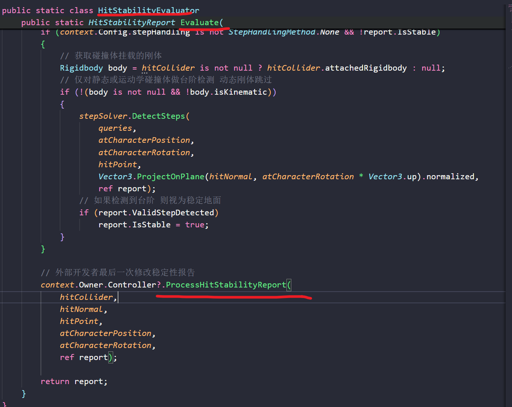

## 1.6 接地 ★3

## 1.7 碰撞移动 ★4

## 1.8 台阶与边缘 ★4

## 1.9 墙角折线 ★**5**

## 1.10 动态刚体 ★5

# 2.移动平台 ★5

# 3.多角色 ★4

# 4.网络同步 ★6
